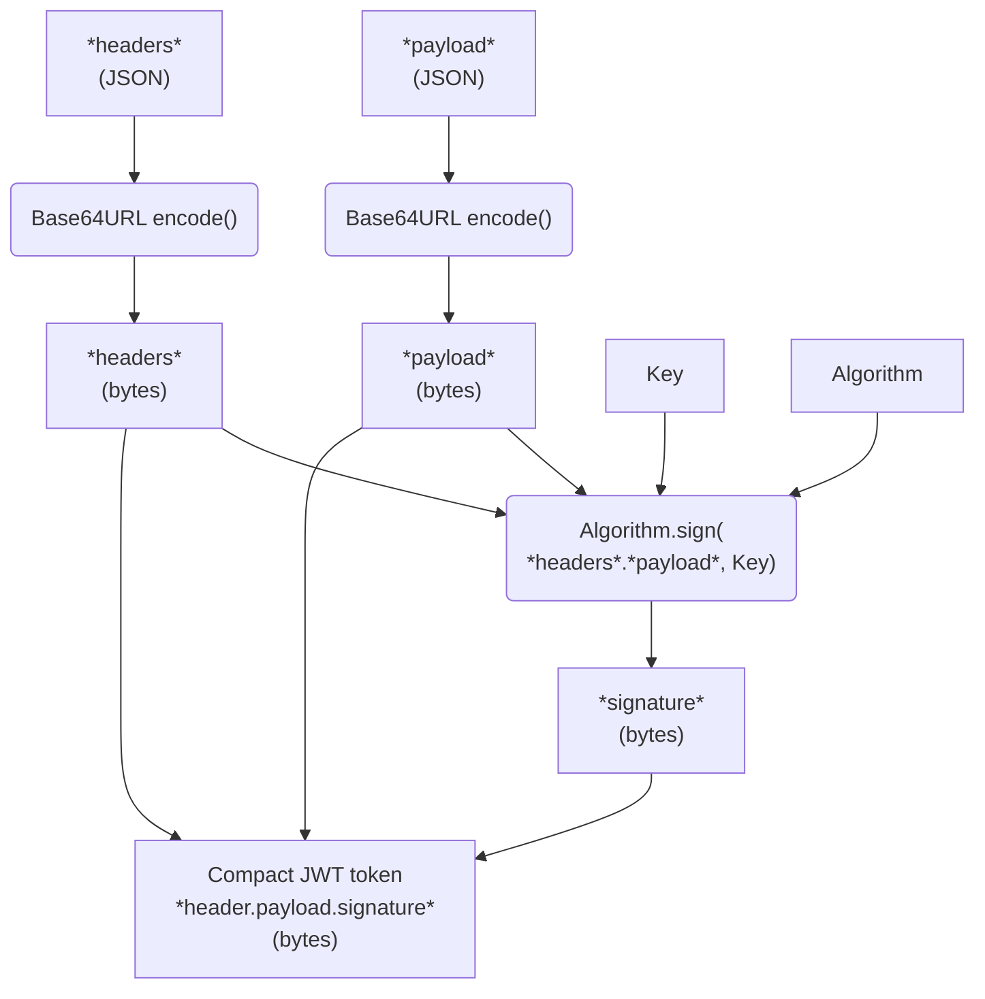
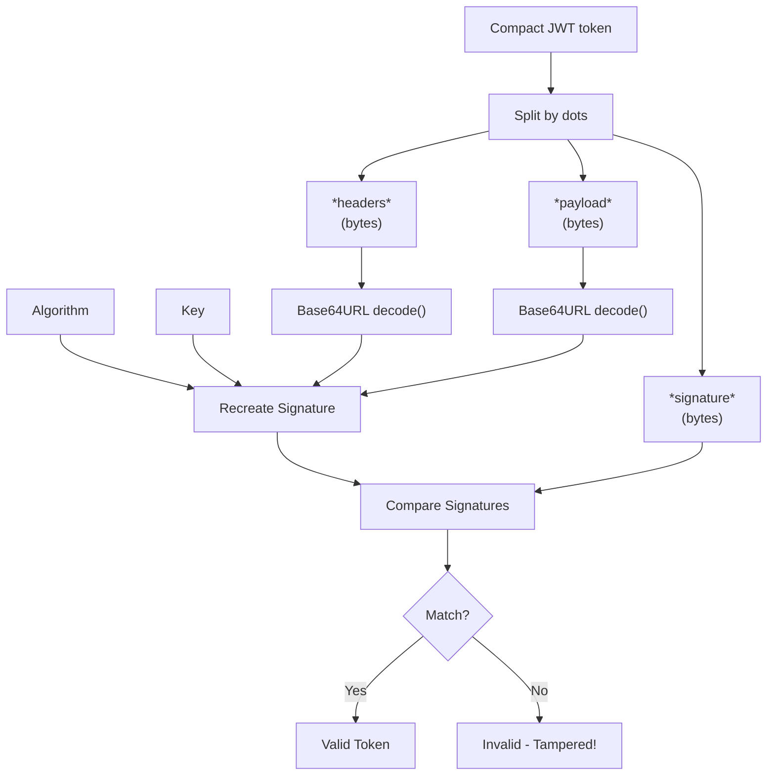

# JWT Basics

## What is a JWT?

**JWT (JSON Web Token)** is an open standard ([RFC 7519](https://datatracker.ietf.org/doc/html/rfc7519)) that defines a compact, URL-safe way to transmit **claims** (a JSON object) between parties.

In most real-world applications, a “JWT token” is a **signed token** (a JWS) whose payload follows the JWT claims conventions.

JWTs are commonly used for:

- **Web authentication / API auth**: clients send a token on each request.
- **Information exchange**: recipients can verify the data was signed by a trusted issuer.
- **Stateless sessions**: the token carries session context so the server doesn’t need session storage.

/// warning | SuperJWT support
SuperJWT currently supports **signed JWTs (JWS)**, not **encrypted JWTs (JWE)**.

Throughout the documentation, “JWT” refers to a JWT payload embedded in a JWS (compact serialization).
///

---

## JWT vs JWS vs JWE

JWT, JWS, and JWE are related standards:

- **JWS (JSON Web Signature)** ([RFC 7515](https://datatracker.ietf.org/doc/html/rfc7515)) defines *how to sign* data and how the token is serialized.
- **JWT (JSON Web Token)** ([RFC 7519](https://datatracker.ietf.org/doc/html/rfc7519)) defines *the meaning and common fields* of the JSON payload (claims).
- **JWE (JSON Web Encryption)** ([RFC 7516](https://datatracker.ietf.org/doc/html/rfc7516)) defines *how to encrypt* a token. (Not supported by SuperJWT.)

In practice, **a signed JWT is a JWS**: the JWS “payload” is a JSON object containing JWT claims.

Relationship between JWT and JWS:

```
┌─────────────────────────────────────┐
│             JWS Token               │
│       (JSON Web Signature)          │
│                                     │
│     Header . Payload . Signature    │
│                 │                   │
│                 ▼                   │
│  ┌───────────────────────────────┐  │
│  │          JWT Claims           │  │
│  │    (JSON Web Token Payload)   │  │
│  └───────────────────────────────┘  │
└─────────────────────────────────────┘
```

**Simply put:**

- **JWS** provides the signing mechanism and structure
- **JWT** defines the standard claims and semantics for the payload
- A **JWT token** is typically a JWS token with JWT-formatted claims

---

## Token Structure

Signed JWTs use the JWS **compact serialization** format:

```
[Header].[Payload].[Signature]
```

All three parts are **Base64URL-encoded** and separated by dots (`.`).

**Example token** (line breaks added for readability):

```python
eyJhbGciOiJIUzI1NiIsInR5cCI6IkpXVCJ9  # (1)
.
eyJzdWIiOiJ1c2VyMTIzIiwiaWF0IjoxNzM0MTM0NDAwfQ  # (2)
.
OpOSSw7e485LOP5PrzScxHb7SR6sAOMRckfFwi4rp7o # (3)
```

1. **Header** (Base64URL-decoded):
```json
{
  "alg": "HS256",
  "typ": "JWT"
}
```

2. **Payload** (Base64URL-decoded):
```json
{
  "sub": "user123",
  "iat": 1734134400
}
```

3. **Signature** (binary data encoded as Base64URL).

For a detailed breakdown of header fields and registered claims, see [JWT Content](content.md).

---

## How JWT/JWS Works

### Token Creation (Encode)



```mermaid
graph TB
    A["*headers* 
    (JSON)"] --> B("Base64URL encode()")
    C["*payload*
    (JSON)"] --> D("Base64URL encode()")
    D --> F["*payload*
    (bytes)"]
    B --> E["*headers*
    (bytes)"]
    E --> H("Algorithm.sign(
      *headers*.*payload*, Key)")
    F --> H
    G["Key"] --> H
    Y["Algorithm"] --> H
    H --> I["*signature*
    (bytes)"]
    I --> J["Compact JWT token
    *header.payload.signature*
    (bytes)"]
    F --> J
    E --> J
```

**Steps:**

1. Create the JOSE header (algorithm and token type).
2. Create the payload with JWT claims.
3. Base64URL encode both the header and the payload.
4. Concatenate them with a dot: `encoded_header.encoded_payload`.
5. Sign this string using the algorithm specified in the header.
6. Base64URL encode the signature.
7. Concatenate all three parts: `header.payload.signature`.

### Token Verification (Decode)


```mermaid
graph TD
    A[Compact JWT token] --> B[Split by dots]
    B --> C["*headers*
    (bytes)"]
    B --> D["*payload*
    (bytes)"]
    B --> E["*signature*
    (bytes)"]
    C --> F["Base64URL decode()"]
    D --> G["Base64URL decode()"]
    H[Algorithm] --> I[Recreate Signature]
    KK[Key] --> I
    F --> I
    G --> I
    I --> J[Compare Signatures]
    E --> J
    J --> K{Match?}
    K -->|Yes| L[Valid Token]
    K -->|No| M[Invalid - Tampered!]
```

**Steps:**

1. Split the token by dots (`.`) into three parts.
2. Base64URL decode the header and payload.
3. Extract the algorithm from the header.
4. Recreate the signature using:
   - The decoded header and payload.
   - The same secret or public key.
   - The algorithm from the header.
5. Compare the recreated signature with the provided signature.
6. If they match → the token is **valid and genuine**.
7. If they don't match → the token is **invalid or tampered with**.

---

## Security Model

### What JWT/JWS provides

- **Integrity**: detects if the token has been tampered with.
- **Authentication**: verifies the token was created by someone with the correct key.
- **Non-repudiation**: the issuer cannot deny signing (when using asymmetric keys).

### What JWT/JWS does not provide

- **Confidentiality**: the payload is only Base64URL-encoded, **not encrypted**.
- **Privacy**: anyone can decode and read the payload.

/// danger | Important Security Note
JWT tokens are **signed, not encrypted**. The payload is only Base64URL-encoded, which means anyone can decode and read it. Never store sensitive information like passwords, credit card numbers, or private keys in JWT claims.
    
If you need encryption, use **JWE (JSON Web Encryption)** instead, which SuperJWT may support in a future version.

///

---

## Where to put JWTs

Most APIs carry JWTs in the `Authorization` header:

```http
Authorization: Bearer <token>
```

If you store JWTs in browsers, be deliberate about your threat model:

- **HTTP-only cookies** reduce exposure to XSS (but you must handle CSRF).
- **Web storage** (localStorage/sessionStorage) is easier but exposes tokens to XSS.

---

## Base64URL Encoding

JWT uses **Base64URL encoding** (not standard Base64) which is URL-safe:

**Differences from standard Base64:**

- Replaces `+` with `-`
- Replaces `/` with `_`
- Removes padding `=` characters

This makes tokens safe to use in:

- URLs (query parameters)
- HTTP headers (Authorization header)
- Cookies
- POST form data

**Example:**

```python
# Standard Base64
"Hello World!" → "SGVsbG8gV29ybGQh"

# Base64URL (no padding)
"Hello World!" → "SGVsbG8gV29ybGQh"

# With special characters
"data+value/test=" → Standard: "ZGF0YSt2YWx1ZS90ZXN0PQ=="
                   → Base64URL: "ZGF0YSt2YWx1ZS90ZXN0"
```

---

## Common Use Cases

### 1. Authentication

```
User Login → Server Issues JWT → Client Stores Token → 
Client Sends Token with Requests → Server Verifies Token → Access Granted
```

### 2. Single Sign-On (SSO)

One JWT token can authenticate across multiple services without additional authentication:

```
Login at Service A → Get JWT → 
Access Service B (same JWT) → Access Service C (same JWT)
```

### 3. Secure Information Exchange

Safely transmit information between parties:

```python
# Party A creates and signs a JWT
token = superjwt.encode(claims={"data": "sensitive_info"}, key=secret_key)

# Party B receives and verifies
claims = superjwt.decode(token, key=secret_key)
# If verification succeeds, Party B knows:
# 1. The token came from someone with the secret key
# 2. The data hasn't been tampered with
```

---

## When to Use JWT

**✅ Use JWT when:**

- Building stateless, scalable APIs (see [FastAPI Integration](../integrations/fastapi.md)).
- Implementing a microservices architecture.
- Sharing authentication across domains.
- Avoiding server-side session storage.
- Building Single Page Applications (SPAs).
- Implementing mobile app authentication.

**❌ Consider alternatives when:**

- You need instant token revocation.
- You are storing large amounts of data.
- You require high security for sensitive operations.
- You are managing long-lived sessions.
- You are building traditional server-rendered applications.

---

## Next Steps

Now that you understand the basics of JWT and JWS:

- Learn about [JWT Content](content.md) - Standard claims, JOSE headers, and payload structure
- Explore [Signing Algorithms](signing-algorithms.md) - HMAC, RSA, ECDSA, and EdDSA
- Check the [Getting Started Guide](../index.md) - Practical usage with SuperJWT

---

## References

- [RFC 7519 - JSON Web Token (JWT)](https://datatracker.ietf.org/doc/html/rfc7519)
- [RFC 7515 - JSON Web Signature (JWS)](https://datatracker.ietf.org/doc/html/rfc7515)
- [JOSE Working Group](https://datatracker.ietf.org/wg/jose/about/) - IETF standards body
